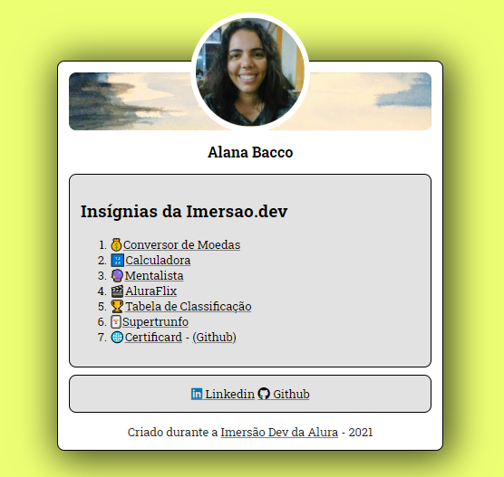

<h1 align="center">
     Certificard - Projeto criado durante a 
     <a href="https://imersao.dev/" alt="Site da Imersão Dev da Alura">
        Imersão Dev da Alura
     </a>
</h1>

## 💻 Sobre o projeto

O projeto Certificard foi desenvolvido durante a Imersao Dev da Alura. Dentro do card se encontram os links para os outros projetos feitos durante a Imersão, que teve 10 aulas no total.

[Acessar o projeto no Codepen](https://codepen.io/alanabacco/pen/BapYjvJ)

    

---

Desenvolvido por [Alana Bacco](https://github.com/alanabacco).  
